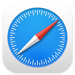

# This IP

  

A minimal, efficient, and modern Browser Extension that instantly displays the IP address of the current website you're visiting. Built with zero external dependencies, and an eye for clean UI.

## Features

- **Floating Badge:** Injects a subtle, glassmorphism badge in the corner of your browser tab showing the site's IP.
- **Dual Stack Support:** Automatically resolves both IPv4 and IPv6 addresses.
- **Quick Copy:** Click the floating badge to instantly copy the IP address to your clipboard and toggle its position between the bottom-right and bottom-left.
- **Popup Dashboard:** Click the extension icon to see a detailed view of the current site's IPv4/IPv6, alongside a quick copy button and manual refresh.
- **Customizable:** Use the popup settings to toggle the visibility of the hexagon icon or the IP tag (e.g., "IPv4") on the floating badge.
- **Privacy First:** Only requires permissions for the active tab and safe storage. Uses DNS-over-HTTPS (DoH) via Google Public DNS as a reliable fallback for cross-platform IP resolution.

## Supported Browsers

|                                          Browser                                           | Supported  |
| :----------------------------------------------------------------------------------------: | :--------: |
|    Google Chrome   |     ✅     |
|     Microsoft Edge     |     ✅     |
|         Brave        |     ✅     |
|  Mozilla Firefox | ⚠️ Partial |
|       Safari       |     ❌     |

## Installation

Since this extension is not yet published to the Chrome Web Store, you can install it manually in Developer Mode:

1. Clone or download this repository to your local machine.
2. Open Google Chrome and navigate to `chrome://extensions/`.
3. Enable **Developer mode** using the toggle switch in the top right corner.
4. Click the **Load unpacked** button.
5. Select the `siteip` folder containing the extension files.
6. The "This IP" extension is now installed and active!

## How It Works

- **Background Service Worker (`scripts/background.js`):** Listens for tab updates and active tab changes. It uses the `chrome.dns` API (where available) and falls back to a public DNS-over-HTTPS API to resolve the hostname of the active tab. Responses are cached to ensure speed and efficiency.
- **Content Script (`scripts/content.js`):** Injected into every page to render the floating badge. It listens for messages from the service worker to update the displayed IP address.
- **Popup UI (`popup/popup.html`):** A sleek, dark-themed dashboard built with vanilla HTML, CSS, and JS. It communicates directly with the background service worker to fetch the latest IP data and update user preferences.

## Development

This project uses raw HTML, CSS, and JavaScript. No build tools (like Webpack or Vite) are required, making it incredibly easy to tweak and test.

1. Make your changes to the CSS or JS files.
2. Go to `chrome://extensions/` or `edge://extensions`.
3. Click the **Refresh** icon on the "This IP" extension card to reload your changes.

## License

MIT License
